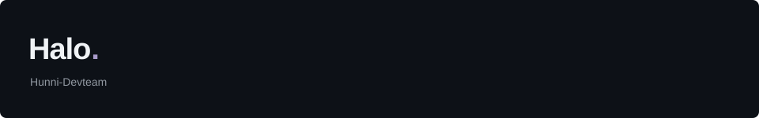
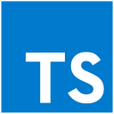
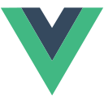
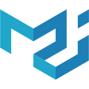
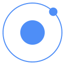
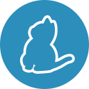
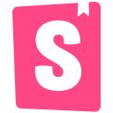

## Toolbox

지금까지 사용해 본 언어와 도구입니다.

   &nbsp;
   &nbsp;
   &nbsp;
   &nbsp;
   &nbsp;
   &nbsp;
   &nbsp;

   &nbsp;
   &nbsp;
   &nbsp;
   &nbsp;
   &nbsp;
   &nbsp;
   &nbsp;

   &nbsp;
   &nbsp;
   &nbsp;
   &nbsp;
   &nbsp;

